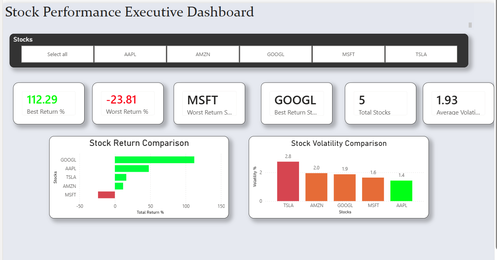
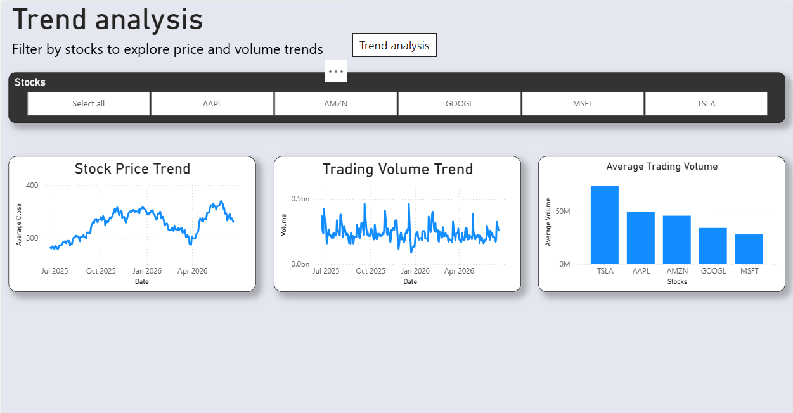

# 📈 Stock Performance Analysis Dashboard

An end-to-end Data Analytics project that automates stock market data collection, stores data in MySQL, performs KPI analysis, and visualizes insights through an interactive Power BI dashboard.

---

## 📌 Project Overview

This project demonstrates a complete data analytics workflow using **Python, MySQL, SQL, and Power BI**. Historical stock data is downloaded from Yahoo Finance, cleaned and validated using Python, stored in a MySQL database, analyzed through custom KPI calculations, and finally visualized using an interactive Power BI dashboard.

The project was developed to simulate a real-world analytics pipeline, covering the complete lifecycle from data acquisition to business reporting.

---

## 🎯 Project Objectives

- Automate stock market data collection.
- Store historical stock data in MySQL.
- Validate and clean datasets.
- Perform KPI and volatility analysis.
- Generate analytical summary reports.
- Build interactive Power BI dashboards.
- Demonstrate an end-to-end analytics workflow.

---

# 🛠 Technologies Used

| Technology | Purpose |
|------------|---------|
| Python | ETL Pipeline & Automation |
| Pandas | Data Cleaning & Analysis |
| yFinance | Stock Market Data API |
| MySQL | Database Storage |
| SQLAlchemy | Database Connectivity |
| PyMySQL | MySQL Driver |
| Matplotlib | Data Visualization |
| Power BI | Dashboard Development |
| Git | Version Control |
| GitHub | Project Hosting |

---

# 🏗 Project Architecture

```text
Yahoo Finance
        │
        ▼
Python ETL Pipeline
        │
        ▼
MySQL Database
        │
        ▼
Data Validation & KPI Analysis
        │
        ▼
CSV Reporting Dataset
        │
        ▼
Power BI Dashboard
```

---

# ✨ Features

- Automated stock data download
- Multi-stock analysis (AAPL, MSFT, GOOGL, AMZN, TSLA)
- MySQL database integration
- Automated data validation
- Moving Average Analysis
- Return Analysis
- Volatility Analysis
- Trading Volume Analysis
- KPI summary report generation
- Automated master pipeline
- Interactive Power BI dashboard
- Dynamic stock filtering using slicers

---

# 📂 Project Structure

```text
StockPerformanceProject/
│
├── data/
│   ├── stocks.csv
│   └── stock_summary_report.csv
│
├── docs/
│   ├── Journal.md
│   └── SQL_Queries.md
│
├── powerbi/
│   ├── StockPerformanceDashboard.pbix
│   ├── dashboard_overview.png
│   ├── dashboard_trends.png
│   └── powerbi_stock_dataset.csv
│
├── scripts/
│   ├── download_multiple_stocks.py
│   ├── load_mysql.py
│   ├── validation.py
│   ├── advanced_kpi_analysis.py
│   ├── moving_average_chart.py
│   ├── return_comparison_chart.py
│   ├── volatility_analysis.py
│   ├── master_pipeline.py
│   └── ...
│
├── sql/
│   └── Project_SQL_Queries.sql
│
├── .gitignore
├── requirements.txt
└── README.md
```

---

# 📊 Dashboard Preview

## Executive Dashboard



---

## Trend Analysis Dashboard



---

# 📈 Dashboard Highlights

The dashboard includes:

- 📈 Best Performing Stock
- 📉 Worst Performing Stock
- 📊 Average Volatility
- 🏢 Total Stocks Analyzed
- 📉 Stock Return Comparison
- 📊 Stock Volatility Comparison
- 📈 Historical Price Trend
- 📊 Trading Volume Trend
- 🔍 Interactive Stock Slicer

---

# 🚀 How to Run the Project

## 1. Clone the repository

```bash
git clone https://github.com/lohith-Aryanxdata/Stock-Performance-Analysis.git
```

---

## 2. Navigate to the project

```bash
cd Stock-Performance-Analysis
```

---

## 3. Install dependencies

```bash
pip install -r requirements.txt
```

---

## 4. Create MySQL Database

Create a database named:

```sql
stock_analysis
```

Update the MySQL credentials inside the Python scripts if required.

---

## 5. Run the Master Pipeline

```bash
python scripts/master_pipeline.py
```

The pipeline will:

- Download stock data
- Load data into MySQL
- Validate the dataset
- Generate KPI summary reports

---

## 6. Open Power BI

Open:

```
powerbi/StockPerformanceDashboard.pbix
```

Refresh the dataset to view the latest analytics.

---

# 📈 Stocks Included

- Apple (AAPL)
- Microsoft (MSFT)
- Google (GOOGL)
- Amazon (AMZN)
- Tesla (TSLA)

---

# 📚 Key Learning Outcomes

This project strengthened practical experience in:

- Python Programming
- Data Cleaning
- ETL Pipeline Development
- SQL & MySQL
- Data Validation
- Data Analysis
- KPI Reporting
- Automation
- Power BI Dashboard Development
- Git & GitHub
- Technical Documentation

---

# 🔮 Future Enhancements

- Connect Power BI directly to the MySQL database.
- Create SQL Views for reporting.
- Automate scheduled pipeline execution.
- Add technical indicators such as RSI, MACD, and Bollinger Bands.
- Expand analysis to additional stocks and market indices.
- Deploy the dashboard using the Power BI Service.

---

# 👨‍💻 Author

**Lohith**

End-to-End Data Analytics Portfolio Project

---

## ⭐ If you found this project interesting, consider giving it a star!
